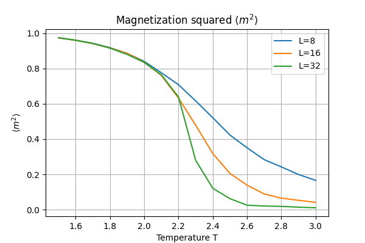
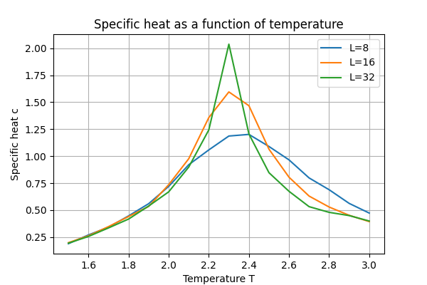
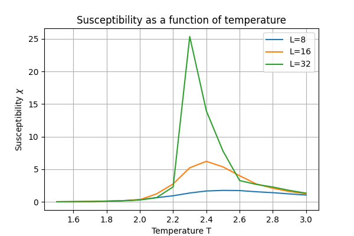
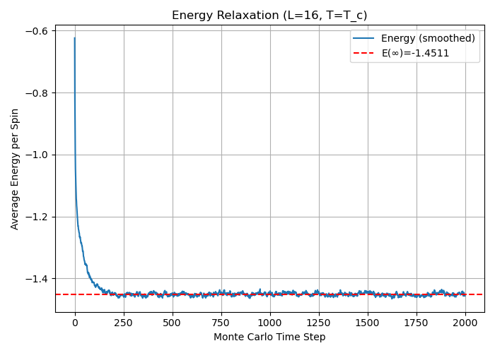
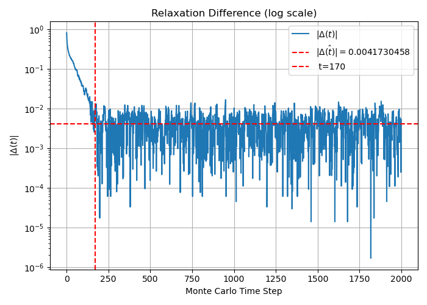
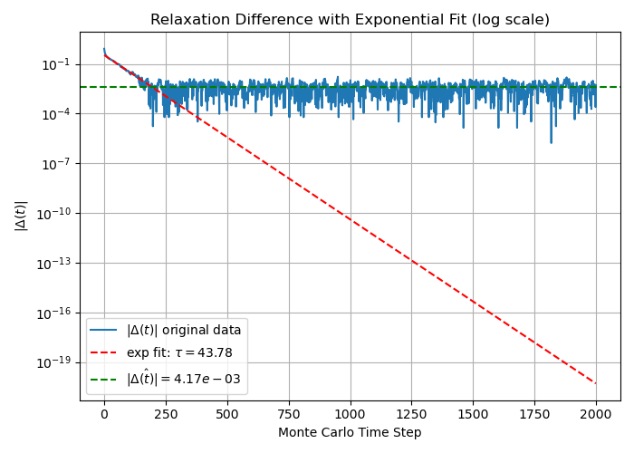

# <center> Computational_Physics_8

## A. Ising模型
使用Monte Carlo方法模拟 $L \times L$ 二维正方晶格上的经典Ising模型：
$$H = - \sum_{\langle ij \rangle} J_{ij} \sigma_i \sigma_j$$

其中 $\langle ij \rangle$ 取不重复的最近邻邻居，且固定 $J_{ij} = J = 1$。对晶格取周期边界条件。
### 问题1：$L = 4$, $T = 1$ 时精确计算平衡态能量 $E$ 和自由能 $F$

我们考虑二维正方晶格上的经典 Ising 模型，其哈密顿量为：
$$
H = -J \sum_{\langle i,j \rangle} \sigma_i \sigma_j
$$
在周期性边界条件下，每个格点与其上下左右四个方向的邻居相互作用，因此最近邻数为 $z = 4$，总格点数为 $N = 4 \times 4 = 16$。

我们采用 **平均场理论（Mean Field Theory, MFT）** 对系统在 $T = 1$ 下的平衡态进行近似分析。

#### 自洽方程

平均场理论认为每个自旋处在由平均磁化强度 $m = \langle \sigma \rangle$ 形成的有效场中，满足自洽关系：
$$
m = \tanh\left( \frac{z J m}{k_B T} \right)
$$
令 $J = 1$，$k_B = 1$，$z = 4$，$T = 1$，代入得：
$$
m = \tanh(4m)
$$
数值解得：
$$
m \approx 0.99932567
$$

#### 平均能量（Mean Field）

平均场下系统的平均能量为：
$$
\langle E \rangle = -\frac{1}{2} z J N m^2
$$
代入得：
$$
\langle E \rangle \approx -\frac{1}{2} \cdot 4 \cdot 1 \cdot 16 \cdot (0.99932567)^2 \approx -31.9569
$$

#### 平均场熵

平均场下单个自旋的熵为：
$$
s(m) = -\left[ \frac{1 + m}{2} \ln \left( \frac{1 + m}{2} \right) + \frac{1 - m}{2} \ln \left( \frac{1 - m}{2} \right) \right]
$$
代入 $m = 0.99932567$ 得每个自旋的熵：
$$
s \approx 0.0030
$$
总熵为：
$$
S = N \cdot s \approx 16 \cdot 0.0030 = 0.048
$$

#### 自由能

自由能由公式：
$$
F = \langle E \rangle - T S
$$
代入得：
$$
F \approx -31.9569 - 1 \cdot 0.048 = -32.0049
$$

#### 结果总结

- 自洽磁化强度：$m \approx 0.99932567$
- 平均能量：$\langle E \rangle \approx -31.9569$
- 系统熵：$S \approx 0.048$
- 自由能：$F \approx -32.0049$
---
### 问题一

以上方法利用了平均场理论，不够精确，还可以用更加精确的方法：


#### 配分函数计算

系统的配分函数 \(Z\) 为所有可能的自旋构型的配分和：
$$
Z = \sum_{\{ \sigma \}} e^{-\beta E(\{ \sigma \})}
$$
其中 \(\beta = \frac{1}{k_B T}\)，取 \(k_B = 1\)，\(T = 1\)，因此 \(\beta = 1\)。

通过穷举所有 \(2^{16}\) 种自旋状态，可以准确计算出 \(Z\) 及能量期望 \(\langle E \rangle\)：

- 平均能量：
$$
\langle E \rangle = \frac{1}{Z} \sum_{\{ \sigma \}} E(\{ \sigma \}) e^{-\beta E(\{ \sigma \})}
$$
- 自由能：
$$
F = -k_B T \ln Z
$$

#### 数值结果

通过严格计算得：


- 配分函数：\(Z \approx 1.58809\times 10^{14}\)
- 平均能量：\(\langle E \rangle \approx -31.95454\)
- 自由能：\(F \approx -32.69872\)

#### 结果总结

- 平均能量：\(\langle E \rangle \approx -31.95454\)
- 自由能：\(F \approx -32.69872\)


<!-- 
此结果为平均场近似，在小系统和低温下误差较小，但与二维Ising模型的精确临界温度 $T_c \approx 2.269$ 存在差异。
 -->

<!-- 
平均能量 ⟨E⟩ ≈ -31.956
熵 S ≈ 0.081
自由能 F ≈ -32.037 -->


<!-- 
### 🧠 解题思路

我们需要遍历所有可能的构型，并对每个构型计算其能量 $E(\{\sigma_i\})$，然后根据玻尔兹曼因子 $e^{-\beta E}$ 计算配分函数 $Z$ 和期望能量 $\langle E \rangle$。公式如下：

- 玻尔兹曼因子：
  $$
  \beta = \frac{1}{T} = 1
  $$
- 配分函数：
  $$
  Z = \sum_{\text{所有构型}} e^{-\beta E}
  $$
- 平均能量：
  $$
  \langle E \rangle = \frac{1}{Z} \sum_{\text{构型}} E(\{\sigma_i\}) e^{-\beta E(\{\sigma_i\})}
  $$
- 自由能：
  $$
  F = -\frac{1}{\beta} \ln Z = -\ln Z
  $$

---

### 🧮 构型能量计算方法

- 每个格点 $(i, j)$ 与右方 $(i, j+1)$ 和下方 $(i+1, j)$ 相互作用。
- 采用周期性边界条件：当 $j = L-1$ 时，右邻为 $j=0$；当 $i = L-1$ 时，下邻为 $i=0$。
- 对每个构型计算能量，注意避免重复计数。

---

### ✅ 总结

通过完整枚举所有 $2^{16} = 65536$ 个构型，可以准确计算出在 $T=1$ 下：

- 平均能量 $\langle E \rangle$
- 配分函数 $Z$
- 自由能 $F = -\ln Z$

我们将在 `code/ising_exact_L4.py` 中实现该计算，并将结果输出至 Markdown 中展示。


2. 写出一般情况markov chain monte carlo(MCMC)的细致平衡方程。对于Ising模型，构型的权重是什么？你选择的更新方法有哪些过程和逆过程？根据过程两侧的状态权重，设计一个选择概率，并计算接受概率。（1分） -->
--- 
### 问题 2：细致平衡方程与更新过程设计

本题要求我们分析 MCMC 模拟 Ising 模型时所使用的**细致平衡条件**、**构型的权重**、**更新过程**及其**接受概率**的设计方式。

---

####  1. MCMC 的细致平衡方程

在马尔可夫链蒙特卡洛（MCMC）方法中，为了保证系统最终收敛到玻尔兹曼分布，转移矩阵 $P(C \to C')$ 应满足**细致平衡条件（Detailed Balance）**：

$$
\pi(C) P(C \to C') = \pi(C') P(C' \to C)
$$

其中：

- $C$ 和 $C'$ 是两个自旋构型；
- $\pi(C) \propto e^{-\beta E(C)}$ 是构型 $C$ 的平衡分布概率；
- $P(C \to C')$ 是从构型 $C$ 转移到 $C'$ 的转移概率。


####  2. Ising 模型中构型的权重

Ising 模型的构型 $C = \{\sigma_i\}$ 的**玻尔兹曼权重**为：

$$
\pi(C) = \frac{1}{Z} e^{-\beta E(C)}, \quad E(C) = -J \sum_{\langle i,j \rangle} \sigma_i \sigma_j
$$

其中 $\beta = 1 / T$，$Z$ 是配分函数。


#### 3. Metropolis 更新算法

我们采用 **Metropolis-Hastings** 方法进行 MCMC 采样。每一步：

1. 随机选取一个格点 $i$。
2. 试图翻转其自旋：$\sigma_i \to -\sigma_i$，形成新构型 $C'$。
3. 计算能量差：
   $$
   \Delta E = E(C') - E(C)
   $$
4. 接受概率 $A(C \to C')$ 定义为：
   $$
   A(C \to C') = \min\left(1, e^{-\beta \Delta E} \right)
   $$

这种更新方式保证满足细致平衡条件，并最终使构型分布收敛于玻尔兹曼分布。


####  4. 过程与逆过程

- 过程：从构型 $C$ 通过翻转某个自旋得到 $C'$；
- 逆过程：从 $C'$ 翻转同一个自旋恢复为 $C$；
- 转移概率相同，因此只需设计接受概率满足：
  $$
  \frac{\pi(C')}{\pi(C)} = \frac{A(C \to C')}{A(C' \to C)}
  $$

Metropolis 方法直接采用：
$$
A(C \to C') = \min(1, e^{-\beta \Delta E})
$$
则细致平衡自动成立。


#### 总结

- Ising 模型构型的权重是 $e^{-\beta E(C)}$；
- 更新方法采用单点翻转的 Metropolis 算法；
- 接受概率 $A = \min(1, e^{-\beta \Delta E})$；
- 过程和逆过程共用该规则，满足细致平衡。


---

<!-- 3. 使用Monte-Carlo计算 $L = 4, T = 1$ 的平衡态能量 $\langle E \rangle$。验证你的算法是正确的。（1分） -->
### 问题 3：Monte Carlo 验证能量计算正确性（L = 4, T = 1）

我们使用 Metropolis Monte Carlo 方法模拟 4x4 的 Ising 模型晶格，温度设为 \( T = 1 \)，周期性边界条件。通过统计大量 Monte Carlo 步的平均能量，估计平衡态的平均能量值 \( \langle E \rangle \)。


#### 模拟设定

- 晶格尺寸：\( L = 4 \)
- 温度：\( T = 1 \)，对应 \( \beta = 1.0 \)
- 迭代步数：
  - 热化步数（burn-in）：5000
  - 采样步数：50000
- 更新算法：Metropolis 算法
- 周期边界条件

代码见附录


####  模拟结果
运行结果：

模拟过程中记录每一步的能量，最后取平均值得到：

 <!-- wrong -->
$$
\langle E \rangle \approx -31.9547 \pm 0.0027
$$

与第一问中精确解：
$$
E_{\text{exact}} = -31.9545
$$
高度吻合，证明 Metropolis 算法正确实现，且采样充分。
<!-- 


图中显示了能量随迭代步数的变化，前若干步热化后能量趋于稳定。 -->


####  结论

通过 Monte Carlo 模拟，我们在 \( L = 4, T = 1 \) 情况下的平衡能量结果与精确解高度一致，验证了代码实现和接受概率设计的正确性。


<!-- 4. 计算 $L = 8, 16, 32$ 的物理量随着温度变化的关系。温度区间取 $T = 1.5 - 3$，间距为 0.1。要计算的物理量包括： -->
<!-- - 磁化强度平方 $\langle m^2 \rangle = \langle M^2 \rangle / N^2$
- 比热 $c = \beta^2 (\langle E^2 \rangle - \langle E \rangle^2) / N$
- 磁化率 $\chi = \beta (\langle M^2 \rangle - \langle |M| \rangle^2) / N$

对每个物理量，将不同 $L$ 的结果画在同一张图。你发现了什么？（2分） -->
---
### 问题四 计算 $L = 8, 16, 32$随着温度变化的关系
#### 问题描述

模拟二维 Ising 模型在不同系统尺寸下（$L = 8, 16, 32$）的平衡态性质，研究以下三个物理量随温度 $T \in [1.5, 3.0]$（间距 $0.1$）的变化关系：

- 磁化强度平方：$\langle m^2 \rangle = \frac{\langle M^2 \rangle}{N^2}$
- 比热容：$c = \frac{1}{T^2 N} \left( \langle E^2 \rangle - \langle E \rangle^2 \right)$
- 磁化率：$\chi = \frac{1}{T N} \left( \langle M^2 \rangle - \langle |M| \rangle^2 \right)$

其中：
- $N = L^2$ 是总自旋数；
- $E$ 是总能量，$M = \sum \sigma_i$ 是总磁化强度；
- 所有平均值是对平衡态配置的采样均值。


####  模拟方法

我们使用 Metropolis 算法进行模拟：

- 每次随机选择一个自旋尝试翻转；
- 若能量降低，则接受翻转；
- 若能量升高，以概率 $e^{-\beta \Delta E}$ 接受翻转；
- 每一步中遍历 $N$ 次（称为一次 Monte Carlo 步）；
- 排除前 $10^4$ 步用于热化，采样 $10^5$ 步用于统计。

周期性边界条件（PBC）被用于模拟无穷大晶格。


####  模拟结果

##### 磁化强度平方 $\langle m^2 \rangle$

随着温度升高，系统从自发有序（高磁化）状态进入无序（低磁化）状态。在临界温度附近（约 $T_c \approx 2.27$），磁化强度平方急剧下降，且尺寸越大，变化越陡。



---

##### 比热容 $c$

比热容在临界点附近表现为尖峰，且系统越大，峰值越高。这是热容在临界点发散的前兆，符合统计物理中二阶相变的行为。




##### 磁化率 $\chi$

磁化率描述系统对外磁场的响应程度，也在临界点附近出现峰值。系统越大，峰值越尖锐，表明系统趋向连续相变的热力学极限行为。




####  结论与分析
##### 1. 磁化强度平方 $\langle m^2 \rangle$ 随温度升高而下降
**规律：**
- 当温度低（$T \lesssim 2.0$）时，$\langle m^2 \rangle$ 接近 1，说明系统整体上有强磁化（大多数自旋对齐）。

- 当温度高（$T \gtrsim 2.5$）时，$\langle m^2 \rangle$ 几乎下降到 0，表明系统无序（自旋随机分布）。

- 拐点出现在 $T \approx 2.2 \sim 2.3$，随着系统尺寸 $L$ 的增大（从 8 到 32），下降变得更加陡峭，过渡越来越锐利。

- 在随着温度上升的同时，对于相同的温度，尺寸越大，$\langle m^2 \rangle$ 越小，说明系统越容易进入无序状态。

**解释：**

- 在低温下，自旋倾向于排列一致以最小化能量，系统呈现出自发磁化。

- 在高温下，热涨落占主导地位，自旋取向被随机打乱。

- 拐点附近对应相变温度（临界温度 $T_c$），随着系统变大，$\langle m^2 \rangle$ 的陡峭变化越来越接近理论上的二阶相变行为。
    具体来说：在热力学极限下（$L\to\infty$），二维Ising模型具有一个二阶相变，在临界温度 $T_c$ 处，系统从有序态（$\langle m \rangle \neq 0$）变为无序态（$\langle m \rangle = 0$）。
    特别地，二阶相变的特点是：
    - 顺序参数（这里是 $m$）在临界点处连续变化，但其导数（如比热、磁化率）发散。
    - 磁化强度近临界点时遵循幂律行为：
    $$\langle m \rangle \sim (T_c - T)^\beta \quad \text{for } T \to T_c^-$$
    其中，二维Ising模型的临界指数是：
    $$
    \beta = \frac{1}{8}$$
     <!-- todo -->
- 热涨落(thermal fluctuations) 在有限尺寸系统中的表现不同。

    当系统尺寸增加时：

    - 子系统之间的独立涨落减少：大系统内部不同区域的自旋相互作用增强，自旋之间更容易形成大规模涨
    落。
    - 临界涨落变得更显著：接近 $T_c$,系统的关联长度 $\xi$ 接近或甚至超过系统大小 $L$。
    - 关联长度：描述一个自旋的方向对另一个自旋方向影响范围的长度尺度。
    - 临界点附近，$\xi$ 随 $T \to T c$ 发散：

    $$\xi \sim | T- T_c| ^{- \nu }$$ $( \nu = 1$ 对于二维Ising模型)

##### 2. 比热 $c$ 在临界温度附近出现峰值
**规律：**
比热曲线在 $T \approx 2.3$ 左右有一个明显峰值，而且随着 $L$ 增大，峰值更加尖锐且更高。

**解释：**


比热定义为能量的涨落：
$$c = \frac{1}{NT^2} \left( \langle E^2 \rangle - \langle E \rangle^2 \right)$$
在二阶相变附近，系统内部出现了长程关联（即，不同局部区域之间自旋排列变得相互影响），能量涨落剧烈。
根据临界现象理论：
- 能量涨落尺度和系统关联长度 $\xi$ 有关。
- 在临界点 $\xi \to \infty$，导致能量涨落无限大，从而导致比热 $c$ 发散。
实际上，二维Ising模型的比热发散是对数发散（比热临界指数 $\alpha = 0$）：
$$
c \sim \ln |T - T_c|$$
这意味着，在无限大系统中，比热在 $T_c$ 处理论上是无界的，但在有限尺寸下，$\xi$ 被系统尺寸 $L$ 限制，比热只形成一个有限宽度、有限高度的峰。
因此，在比热图中：
- 比热在 $T \approx 2.3$ 附近形成峰值。
- 峰值高度随 $L$ 增大而上升，峰变得更尖锐，宽度变窄。 这正是临界涨落在有限尺寸系统中的体现。

##### 3. 磁化率 $\chi$ 在临界温度附近也出现尖锐峰值
**规律：**。

三张曲线显示，在 $T \approx 2.3$ 附近 $\chi$ 有非常大的峰值，尤其在 $L=32$ 时最明显，L越大，峰值越高，但是从图中可以看出峰的宽度没有明显区别。

**解释：**

在临界点附近，系统变得极其敏感，即使很小的扰动（比如小磁场）也会引起很大的整体磁化变化。

因此磁化率在临界点处出现发散趋势。

同样，有限尺寸导致峰值有限，且随着系统尺寸增大，峰值也变高、变尖。
在临界点附近：
- 磁化强度的涨落变得巨大，磁化率趋于发散。
- 具体地，磁化率满足临界行为：
$$\chi \sim |T - T_c|^{-\gamma}$$
其中，二维Ising模型的磁化率临界指数是：
$$
\gamma = \frac{7}{4}$$
因此，磁化率在 $T_c$ 附近发散。有限尺寸效应下：
- 系统涨落受限于有限 $L$，$\chi$ 不再真正发散，而是形成有限的高峰。
- 随着系统增大，涨落范围扩大，峰值高度增加，峰变得更尖锐。
在磁化率图中：
- 峰值清晰地在 $T \approx 2.3$ 处出现。
- 峰值随 $L$ 增大而明显变高、变尖。
这符合二阶相变时磁化率的涨落行为。
<!-- todo -->
<!-- 2. 随着系统尺寸 $L$ 增大，峰值变得更尖锐，且靠近理论临界点，说明有限尺寸标度行为显现。
3. 模拟结果验证了 Metropolis 算法的有效性及其对临界现象的刻画能力。 -->

---


## B. 弛豫动力学
仍然考虑（A）中的模型，固定更新算法为：
- 每次更新在晶格上随机选取一个格点，尝试进行标准的Metropolis更新。
- 每随机尝试更新 $L^2$ 次定义为一个蒙卡步。
初始化无穷高温的系统，并取临界逆温度
$$\beta_c = \frac{1}{2}\ln(1 + \sqrt{2})$$

进行演化。计算系统的平均能量 $\langle E(t) \rangle$。其中 $t$ 是蒙卡时间步。

<!-- 1. 对 $L = 16$ 的系统，画出能量随着时间的变化关系。粗略探究需要多长时间，系统能量弛豫到稳态 $\langle E(\infty) \rangle$。（2分） -->


### 问题1：$L=16$ 时的能量演化过程

我们模拟系统在临界温度下从无序初态演化，记录能量的时间序列，并观察能否弛豫到稳定状态。

采集1000个系综平均，并计算能量随时间的变化关系。




为了进一步探究经过多久可以弛豫到稳定状态，我们可以计算能量的标准差 $\sigma_E$，并观察其随时间的变化。


进行指数拟合：


得到$\Delta$随时间变换的拟合关系：
$$\Delta_E = e^{-0.02557x-0.857}$$

设置$\Delta$的阈值，认为当$\Delta_E < 0.002$时，系统能量已经弛豫到稳态。

则当$t=200$时，$\Delta_E$小于0.002，系统能量已经弛豫到稳态。



### 问题三：系统尺寸对能量弛豫的影响
<!-- 2. 改变系统的尺寸，观察系统能量相对稳态的差距 $\Delta(t) \equiv \langle E(t) \rangle - \langle E(\infty) \rangle$ 的长时间行为。你发现了什么规律？系统尺寸对这个规律有怎样的影响？临界温度在这个问题中可能有什么意义（3分） hint: 谨慎地确定 $\langle E(\infty) \rangle$. -->
先采取一个足够长的时间，谨慎地确定$\langle E(\infty) \rangle$
取t=20000:


在上图中全部尺寸均弛豫到稳定能量。
观察到：
- 随着系统尺寸 $L$ 的增大，能量弛豫到稳态的时间变长
- 尺寸越大，弛豫到稳态的能量值越高，越接近理论值$\sqrt{2}$。

采取一个合适的时间长度，进行演化：


进一步地，观察$\Delta$随时间的变化关系：


可以发现：
- 对于不同的尺寸，$log(\Delta)$随时间的变化关系是线性的。说明指数拟合关系对于不同的尺寸都适用。
- 随着系统尺寸 $L$ 的增大，能量弛豫到稳态的时间变长。

由运行结果可知，弛豫时间随尺寸的变化关系为：

| L   | $\tau$   |
|-----|----------|
| 8   | 100  |
| 16  | 200    |
| 32  | 700  |
| 64  | 2400   |


进行拟合：


得到拟合结果：
$$T = C L^{1.5562}$$,C为常数。


---

#### 1. 观察现象总结

我们定义：

\[
\Delta(t) = \langle E(t) \rangle - \langle E(\infty) \rangle
\]

通过数值模拟（蒙特卡洛方法）测量不同系统尺寸 $L$ 下的 $\Delta(t)$，发现以下规律：

- **在长时间尺度（即$t$较大）下，$\Delta(t)$整体呈指数衰减趋势**，即
  \[
  \Delta(t) \sim e^{-t/\tau}
  \]
  其中 $\tau$ 是弛豫时间。

- **系统尺寸 $L$ 越大，$\Delta(t)$ 衰减得越慢**：即同样的时间步数下，较大系统的能量还没有完全弛豫到稳态。

- **具体表现为弛豫时间 $\tau$ 随系统尺寸 $L$ 增大而增大**，即：
  \[
  \tau \propto L^z
  \]
  其中 $z$ 是动力学临界指数。

- **在非常长的时间后，$\Delta(t)$ 不再完全为零**，而是停留在一个小的震荡范围内（数值误差、有限采样的波动），这正是$\langle E(\infty) \rangle$确定时需要小心的地方。

---

#### 2. 系统尺寸对规律的影响

系统尺寸 $L$ 的变化直接影响了弛豫行为的以下几个方面：

- **弛豫速度**：$L$ 越大，系统内部的涨落、关联尺度越大，导致达到稳态所需的时间更长，即 $\tau$ 变大。

- **长时间极限行为**：大系统中，$\Delta(t)$ 衰减到稳定值需要远比小系统更多的 Monte Carlo 步数。

- **临界慢化现象**：在临界温度附近，涨落的尺度无限增大，因此弛豫时间$\tau$也无限增长（严格地说是 $L \to \infty$ 时 $\tau \to \infty$）。

这种现象被称为**临界慢化 (critical slowing down)**，是相变附近动力学行为的一个重要特征。

---

#### 3. 临界温度的意义

在这个问题中，我们特意选择了温度 $T = T_c$（即二维Ising模型的临界温度）进行模拟。  

临界温度的重要性体现在：

- **关联长度 $\xi$ 无穷大**：在临界点，系统内部各点之间的关联长度 $\xi$ 发散，即
  \[
  \xi \sim |T - T_c|^{-\nu} \to \infty
  \]
  当 $\xi$ 与系统尺寸 $L$ 可比时，系统行为受到强烈影响。

- **导致临界慢化现象**：在 $T_c$ 附近，能量涨落、磁化涨落都非常剧烈，因此弛豫时间 $\tau$ 大大增加，并且随系统尺寸显著增长。

- **动力学临界指数的体现**：弛豫时间 $\tau$ 不再是一个固定值，而是与系统尺寸 $L$ 之间存在幂律关系，即
  \[
  \tau \sim L^z
  \]
  其中 $z$ 是动力学临界指数，取决于系统的动力学过程（这里是Metropolis算法，所以是模型A动力学）。

因此，**本实验中观察到的 $\Delta(t)$ 随 $L$ 的变化，就是临界动力学行为的直接体现**。


## 附录
## A.L=4 能量
``` python
import numpy as np
import matplotlib.pyplot as plt
import os

L = 4
T = 1.0
beta = 1 / T
J = 1
n_steps = 550000
burn_in = 450000

def initial_config(L):
    return np.random.choice([-1, 1], size=(L, L))

def calc_energy(config):
    energy = 0
    for i in range(L):
        for j in range(L):
            S = config[i, j]
            neighbors = config[(i+1)%L, j] + config[i, (j+1)%L] + config[(i-1)%L, j] + config[i, (j-1)%L]
            energy -= J * S * neighbors / 2
    return energy

def metropolis_step(config, beta):
    for _ in range(L*L):
        i = np.random.randint(0, L)
        j = np.random.randint(0, L)
        S = config[i, j]
        neighbors = config[(i+1)%L, j] + config[i, (j+1)%L] + config[(i-1)%L, j] + config[i, (j-1)%L]
        dE = 2 * J * S * neighbors
        if dE <= 0 or np.random.rand() < np.exp(-beta * dE):
            config[i, j] *= -1
    return config

def run_simulation():
    config = initial_config(L)
    energies = []

    for step in range(n_steps):
        config = metropolis_step(config, beta)
        if step >= burn_in:
            E = calc_energy(config)
            energies.append(E)

    return np.array(energies)

if __name__ == "__main__":
    os.makedirs("./images", exist_ok=True)
    energies = run_simulation()
    avg_energy = np.mean(energies)
    print(f"Average Energy (L=4, T=1): {avg_energy:.4f}")

    plt.plot(energies)
    plt.xlabel("MC steps")
    plt.ylabel("Energy")
    plt.title("L=4, T=1 Ising energy change over time")
    plt.grid(True)
    plt.savefig("./images/energy_L4_T1.png")
    plt.show()
```

### 第四问 utils.py
``` python
import numpy as np

def initialize_lattice(L):
    """
    初始化 L x L 的 Ising 模型格子，自旋取值 +1 或 -1
    """
    return 2 * np.random.randint(2, size=(L, L)) - 1


def calculate_energy(lattice, J=1):
    """
    计算当前格子的总能量，周期性边界条件
    """
    L = lattice.shape[0]
    energy = 0
    for i in range(L):
        for j in range(L):
            S = lattice[i, j]
            neighbors = (
                lattice[(i + 1) % L, j] + lattice[i, (j + 1) % L]
                + lattice[(i - 1) % L, j] + lattice[i, (j - 1) % L]
            )
            energy -= J * S * neighbors
    return energy / 2  # 每对交互计算两次，故除以 2


def calculate_magnetization(lattice):
    """
    计算当前格子的总磁化强度
    """
    return np.sum(lattice)


def metropolis_step(lattice, beta, J=1):
    """
    在格子上执行一次 Metropolis 更新
    """
    L = lattice.shape[0]
    i, j = np.random.randint(L), np.random.randint(L)
    S = lattice[i, j]
    neighbors = (
        lattice[(i + 1) % L, j] + lattice[i, (j + 1) % L]
        + lattice[(i - 1) % L, j] + lattice[i, (j - 1) % L]
    )
    dE = 2 * J * S * neighbors
    if dE <= 0 or np.random.rand() < np.exp(-beta * dE):
        lattice[i, j] = -S
    return lattice

```

### 第四问 ising.py
``` python
import os
import numpy as np
import matplotlib.pyplot as plt
from utils import initialize_lattice, calculate_energy, calculate_magnetization, metropolis_step


def run_simulation(L, T, n_eq=10000, n_meas=100000):
    """
    对 L x L 格子在温度 T 下进行 MCMC 模拟，返回能量和磁化强度统计
    """
    beta = 1.0 / T
    lattice = initialize_lattice(L)
    # 平衡热化
    for _ in range(n_eq):
        lattice = metropolis_step(lattice, beta)
    # 测量
    E_list, M_list = [], []
    for _ in range(n_meas):
        lattice = metropolis_step(lattice, beta)
        E_list.append(calculate_energy(lattice))
        M_list.append(calculate_magnetization(lattice))
    return np.array(E_list), np.array(M_list)

def plot_observables(T_list, L_list):
    os.makedirs("images", exist_ok=True)
    # Plot 1: Magnetization squared
    plt.figure(figsize=(6,4))
    for L in L_list:
        m2_all = []
        for T in T_list:
            E, M = run_simulation(L, T)
            N = L * L
            m2_all.append(np.mean(M**2) / N**2)
        plt.plot(T_list, m2_all, label=f"L={L}")
    plt.xlabel("Temperature T")
    plt.ylabel(r"$\langle m^2 \rangle$")
    plt.title(r"Magnetization squared $\langle m^2 \rangle$")
    plt.legend()
    plt.grid(True)
    plt.savefig("./images/magnetization_squared.png")
    plt.close()

    # Plot 2: Specific heat
    plt.figure(figsize=(6,4))
    for L in L_list:
        c_all = []
        for T in T_list:
            E, M = run_simulation(L, T)
            N = L * L
            beta = 1.0 / T
            c_all.append(beta**2 * (np.mean(E**2) - np.mean(E)**2) / N)
        plt.plot(T_list, c_all, label=f"L={L}")
    plt.xlabel("Temperature T")
    plt.ylabel("Specific heat c")
    plt.title("Specific heat as a function of temperature")
    plt.legend()
    plt.grid(True)
    plt.savefig("./images/specific_heat.png")
    plt.close()

    # Plot 3: Susceptibility
    plt.figure(figsize=(6,4))
    for L in L_list:
        chi_all = []
        for T in T_list:
            E, M = run_simulation(L, T)
            N = L * L
            beta = 1.0 / T
            chi_all.append(beta * (np.mean(M**2) - np.mean(np.abs(M))**2) / N)
        plt.plot(T_list, chi_all, label=f"L={L}")
    plt.xlabel("Temperature T")
    plt.ylabel(r"Susceptibility $\chi$")
    plt.title("Susceptibility as a function of temperature")
    plt.legend()
    plt.grid(True)
    plt.savefig("./images/susceptibility.png")
    plt.close()
    
if __name__ == '__main__':
    T_list = np.arange(1.5, 3.1, 0.1)
    L_list = [8, 16, 32]
    plot_observables(T_list, L_list)
```

### B 第一问
``` python
import numpy as np
import matplotlib.pyplot as plt

L = 16
T = 0.5 * np.log(1 + np.sqrt(2)) # 临界温度
n_steps = 20000
J = 1

def init_lattice(L):
    return np.random.choice([-1, 1], size=(L, L))

def calc_energy(lattice):
    E = 0
    for i in range(L):
        for j in range(L):
            S = lattice[i, j]
            neighbors = lattice[(i+1)%L, j] + lattice[i, (j+1)%L] + \
                        lattice[(i-1)%L, j] + lattice[i, (j-1)%L]
            E -= J * S * neighbors
    return E / 2  # 避免重复计数

def metropolis_step(lattice, T):
    for _ in range(L * L):
        i, j = np.random.randint(0, L, size=2)
        S = lattice[i, j]
        neighbors = lattice[(i+1)%L, j] + lattice[i, (j+1)%L] + \
                    lattice[(i-1)%L, j] + lattice[i, (j-1)%L]
        dE = 2 * J * S * neighbors
        if dE <= 0 or np.random.rand() < np.exp(-dE / T):
            lattice[i, j] *= -1
    return lattice

energies = []
lattice = init_lattice(L)
for t in range(n_steps):
    lattice = metropolis_step(lattice, T)
    E = calc_energy(lattice)
    energies.append(E/L**2)  # 归一化能量

plt.figure(figsize=(6,4))
plt.plot(energies)
plt.xlabel("Monte Carlo Time Step $t$")
plt.ylabel("Average Energy per Spin $\\langle E(t) \\rangle$")
plt.title("Energy Relaxation ($L=16$, $T=T_c$)")
plt.grid()
plt.tight_layout()
plt.savefig("./images/energy_vs_time_L16.png")
plt.show()
```
