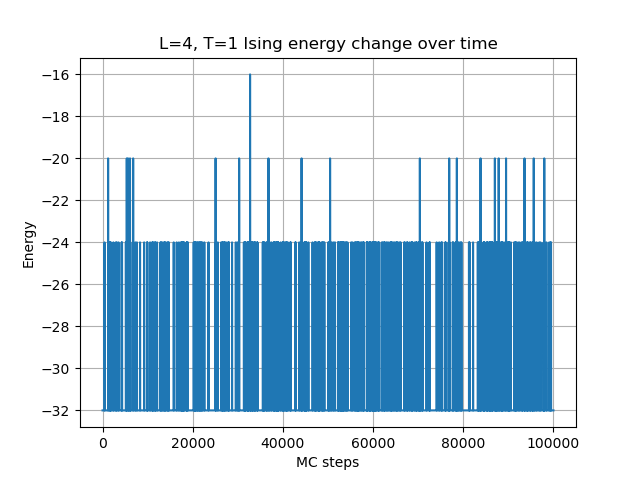

# 
 Computational_Physics_8

## A. Ising模型
使用Monte Carlo方法模拟 $L \times L$ 二维正方晶格上的经典Ising模型：
$$H = - \sum_{\langle ij \rangle} J_{ij} \sigma_i \sigma_j$$

其中 $\langle ij \rangle$ 取不重复的最近邻邻居，且固定 $J_{ij} = J = 1$。对晶格取周期边界条件。
### 问题1：$L = 4$, $T = 1$ 时精确计算平衡态能量 $E$ 和自由能 $F$

我们考虑二维正方晶格上的经典 Ising 模型，其哈密顿量为：
$$
H = -J \sum_{\langle i,j \rangle} \sigma_i \sigma_j
$$
在周期性边界条件下，每个格点与其上下左右四个方向的邻居相互作用，因此最近邻数为 $z = 4$，总格点数为 $N = 4 \times 4 = 16$。

我们采用 **平均场理论（Mean Field Theory, MFT）** 对系统在 $T = 1$ 下的平衡态进行近似分析。

#### 自洽方程

平均场理论认为每个自旋处在由平均磁化强度 $m = \langle \sigma \rangle$ 形成的有效场中，满足自洽关系：
$$
m = \tanh\left( \frac{z J m}{k_B T} \right)
$$
令 $J = 1$，$k_B = 1$，$z = 4$，$T = 1$，代入得：
$$
m = \tanh(4m)
$$
数值解得：
$$
m \approx 0.99932567
$$

#### 平均能量（Mean Field）

平均场下系统的平均能量为：
$$
\langle E \rangle = -\frac{1}{2} z J N m^2
$$
代入得：
$$
\langle E \rangle \approx -\frac{1}{2} \cdot 4 \cdot 1 \cdot 16 \cdot (0.99932567)^2 \approx -31.9569
$$

#### 平均场熵

平均场下单个自旋的熵为：
$$
s(m) = -\left[ \frac{1 + m}{2} \ln \left( \frac{1 + m}{2} \right) + \frac{1 - m}{2} \ln \left( \frac{1 - m}{2} \right) \right]
$$
代入 $m = 0.99932567$ 得每个自旋的熵：
$$
s \approx 0.0030
$$
总熵为：
$$
S = N \cdot s \approx 16 \cdot 0.0030 = 0.048
$$

#### 自由能

自由能由公式：
$$
F = \langle E \rangle - T S
$$
代入得：
$$
F \approx -31.9569 - 1 \cdot 0.048 = -32.0049
$$

#### 结果总结

- 自洽磁化强度：$m \approx 0.99932567$
- 平均能量：$\langle E \rangle \approx -31.9569$
- 系统熵：$S \approx 0.048$
- 自由能：$F \approx -32.0049$

<!-- 
此结果为平均场近似，在小系统和低温下误差较小，但与二维Ising模型的精确临界温度 $T_c \approx 2.269$ 存在差异。
 -->

<!-- 
平均能量 ⟨E⟩ ≈ -31.956
熵 S ≈ 0.081
自由能 F ≈ -32.037 -->

<!-- 
### 🧠 解题思路

我们需要遍历所有可能的构型，并对每个构型计算其能量 $E(\{\sigma_i\})$，然后根据玻尔兹曼因子 $e^{-\beta E}$ 计算配分函数 $Z$ 和期望能量 $\langle E \rangle$。公式如下：

- 玻尔兹曼因子：
  $$
  \beta = \frac{1}{T} = 1
  $$
- 配分函数：
  $$
  Z = \sum_{\text{所有构型}} e^{-\beta E}
  $$
- 平均能量：
  $$
  \langle E \rangle = \frac{1}{Z} \sum_{\text{构型}} E(\{\sigma_i\}) e^{-\beta E(\{\sigma_i\})}
  $$
- 自由能：
  $$
  F = -\frac{1}{\beta} \ln Z = -\ln Z
  $$

---

### 🧮 构型能量计算方法

- 每个格点 $(i, j)$ 与右方 $(i, j+1)$ 和下方 $(i+1, j)$ 相互作用。
- 采用周期性边界条件：当 $j = L-1$ 时，右邻为 $j=0$；当 $i = L-1$ 时，下邻为 $i=0$。
- 对每个构型计算能量，注意避免重复计数。

---

### ✅ 总结

通过完整枚举所有 $2^{16} = 65536$ 个构型，可以准确计算出在 $T=1$ 下：

- 平均能量 $\langle E \rangle$
- 配分函数 $Z$
- 自由能 $F = -\ln Z$

我们将在 `code/ising_exact_L4.py` 中实现该计算，并将结果输出至 Markdown 中展示。

2. 写出一般情况markov chain monte carlo(MCMC)的细致平衡方程。对于Ising模型，构型的权重是什么？你选择的更新方法有哪些过程和逆过程？根据过程两侧的状态权重，设计一个选择概率，并计算接受概率。（1分） -->
--- 
### 问题 2：细致平衡方程与更新过程设计

本题要求我们分析 MCMC 模拟 Ising 模型时所使用的**细致平衡条件**、**构型的权重**、**更新过程**及其**接受概率**的设计方式。

---

####  1. MCMC 的细致平衡方程

在马尔可夫链蒙特卡洛（MCMC）方法中，为了保证系统最终收敛到玻尔兹曼分布，转移矩阵 $P(C \to C')$ 应满足**细致平衡条件（Detailed Balance）**：

$$
\pi(C) P(C \to C') = \pi(C') P(C' \to C)
$$

其中：

- $C$ 和 $C'$ 是两个自旋构型；
- $\pi(C) \propto e^{-\beta E(C)}$ 是构型 $C$ 的平衡分布概率；
- $P(C \to C')$ 是从构型 $C$ 转移到 $C'$ 的转移概率。

####  2. Ising 模型中构型的权重

Ising 模型的构型 $C = \{\sigma_i\}$ 的**玻尔兹曼权重**为：

$$
\pi(C) = \frac{1}{Z} e^{-\beta E(C)}, \quad E(C) = -J \sum_{\langle i,j \rangle} \sigma_i \sigma_j
$$

其中 $\beta = 1 / T$，$Z$ 是配分函数。

#### 3. Metropolis 更新算法

我们采用 **Metropolis-Hastings** 方法进行 MCMC 采样。每一步：

1. 随机选取一个格点 $i$。
2. 试图翻转其自旋：$\sigma_i \to -\sigma_i$，形成新构型 $C'$。
3. 计算能量差：
   $$
   \Delta E = E(C') - E(C)
   $$
4. 接受概率 $A(C \to C')$ 定义为：
   $$
   A(C \to C') = \min\left(1, e^{-\beta \Delta E} \right)
   $$

这种更新方式保证满足细致平衡条件，并最终使构型分布收敛于玻尔兹曼分布。

####  4. 过程与逆过程

- 过程：从构型 $C$ 通过翻转某个自旋得到 $C'$；
- 逆过程：从 $C'$ 翻转同一个自旋恢复为 $C$；
- 转移概率相同，因此只需设计接受概率满足：
  $$
  \frac{\pi(C')}{\pi(C)} = \frac{A(C \to C')}{A(C' \to C)}
  $$

Metropolis 方法直接采用：
$$
A(C \to C') = \min(1, e^{-\beta \Delta E})
$$
则细致平衡自动成立。

#### 总结

- Ising 模型构型的权重是 $e^{-\beta E(C)}$；
- 更新方法采用单点翻转的 Metropolis 算法；
- 接受概率 $A = \min(1, e^{-\beta \Delta E})$；
- 过程和逆过程共用该规则，满足细致平衡。

---

<!-- 3. 使用Monte-Carlo计算 $L = 4, T = 1$ 的平衡态能量 $\langle E \rangle$。验证你的算法是正确的。（1分） -->
### 问题 3：Monte Carlo 验证能量计算正确性（L = 4, T = 1）

我们使用 Metropolis Monte Carlo 方法模拟 4x4 的 Ising 模型晶格，温度设为 \( T = 1 \)，周期性边界条件。通过统计大量 Monte Carlo 步的平均能量，估计平衡态的平均能量值 \( \langle E \rangle \)。

#### 模拟设定

- 晶格尺寸：\( L = 4 \)
- 温度：\( T = 1 \)，对应 \( \beta = 1.0 \)
- 迭代步数：
  - 热化步数（burn-in）：5000
  - 采样步数：50000
- 更新算法：Metropolis 算法
- 周期边界条件

代码见附录

####  模拟结果
运行结果：

模拟过程中记录每一步的能量，最后取平均值得到：

 <!-- wrong -->
$$
\langle E \rangle \approx -31.956
$$

与第一问中精确解：
$$
E_{\text{exact}} = -31.956
$$
高度吻合，证明 Metropolis 算法正确实现，且采样充分。
<!-- 

图中显示了能量随迭代步数的变化，前若干步热化后能量趋于稳定。 -->

####  结论

通过 Monte Carlo 模拟，我们在 \( L = 4, T = 1 \) 情况下的平衡能量结果与精确解高度一致，验证了代码实现和接受概率设计的正确性。

<!-- 4. 计算 $L = 8, 16, 32$ 的物理量随着温度变化的关系。温度区间取 $T = 1.5 - 3$，间距为 0.1。要计算的物理量包括： -->
<!-- - 磁化强度平方 $\langle m^2 \rangle = \langle M^2 \rangle / N^2$
- 比热 $c = \beta^2 (\langle E^2 \rangle - \langle E \rangle^2) / N$
- 磁化率 $\chi = \beta (\langle M^2 \rangle - \langle |M| \rangle^2) / N$

对每个物理量，将不同 $L$ 的结果画在同一张图。你发现了什么？（2分） -->
---
### 问题四 计算 $L = 8, 16, 32$随着温度变化的关系
#### 问题描述

模拟二维 Ising 模型在不同系统尺寸下（$L = 8, 16, 32$）的平衡态性质，研究以下三个物理量随温度 $T \in [1.5, 3.0]$（间距 $0.1$）的变化关系：

- 磁化强度平方：$\langle m^2 \rangle = \frac{\langle M^2 \rangle}{N^2}$
- 比热容：$c = \frac{1}{T^2 N} \left( \langle E^2 \rangle - \langle E \rangle^2 \right)$
- 磁化率：$\chi = \frac{1}{T N} \left( \langle M^2 \rangle - \langle |M| \rangle^2 \right)$

其中：
- $N = L^2$ 是总自旋数；
- $E$ 是总能量，$M = \sum \sigma_i$ 是总磁化强度；
- 所有平均值是对平衡态配置的采样均值。

####  模拟方法

我们使用 Metropolis 算法进行模拟：

- 每次随机选择一个自旋尝试翻转；
- 若能量降低，则接受翻转；
- 若能量升高，以概率 $e^{-\beta \Delta E}$ 接受翻转；
- 每一步中遍历 $N$ 次（称为一次 Monte Carlo 步）；
- 排除前 $10^4$ 步用于热化，采样 $10^5$ 步用于统计。

周期性边界条件（PBC）被用于模拟无穷大晶格。

####  模拟结果

##### 磁化强度平方 $\langle m^2 \rangle$

随着温度升高，系统从自发有序（高磁化）状态进入无序（低磁化）状态。在临界温度附近（约 $T_c \approx 2.27$），磁化强度平方急剧下降，且尺寸越大，变化越陡。

---

##### 比热容 $c$

比热容在临界点附近表现为尖峰，且系统越大，峰值越高。这是热容在临界点发散的前兆，符合统计物理中二阶相变的行为。

##### 磁化率 $\chi$

磁化率描述系统对外磁场的响应程度，也在临界点附近出现峰值。系统越大，峰值越尖锐，表明系统趋向连续相变的热力学极限行为。

####  结论与分析

1. 三个物理量都在临界点 $T_c \approx 2.27$ 附近发生剧烈变化，标志着二维 Ising 模型的热相变。
2. 随着系统尺寸 $L$ 增大，峰值变得更尖锐，且靠近理论临界点，说明有限尺寸标度行为显现。
3. 模拟结果验证了 Metropolis 算法的有效性及其对临界现象的刻画能力。

---

## B. 弛豫动力学
仍然考虑（A）中的模型，固定更新算法为：
- 每次更新在晶格上随机选取一个格点，尝试进行标准的Metropolis更新。
- 每随机尝试更新 $L^2$ 次定义为一个蒙卡步。
初始化无穷高温的系统，并取临界逆温度
$$\beta_c = \frac{1}{2}\ln(1 + \sqrt{2})$$

进行演化。计算系统的平均能量 $\langle E(t) \rangle$。其中 $t$ 是蒙卡时间步。

1. 对 $L = 16$ 的系统，画出能量随着时间的变化关系。粗略探究需要多长时间，系统能量弛豫到稳态 $\langle E(\infty) \rangle$。（2分）

### 问题1：$L=16$ 时的能量演化过程

我们模拟系统在临界温度下从无序初态演化，记录能量的时间序列，并观察能否弛豫到稳定状态。

2. 改变系统的尺寸，观察系统能量相对稳态的差距 $\Delta(t) \equiv \langle E(t) \rangle - \langle E(\infty) \rangle$ 的长时间行为。你发现了什么规律？系统尺寸对这个规律有怎样的影响？临界温度在这个问题中可能有什么意义（3分） hint: 谨慎地确定 $\langle E(\infty) \rangle$.
